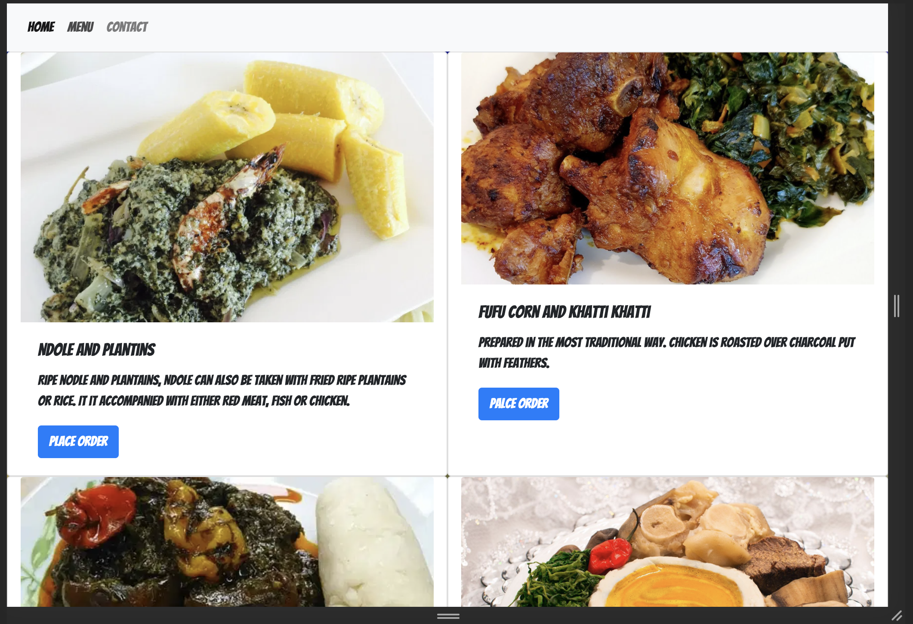

# library-app

## App

## About 

This is a simple single-page application that displaces different content when a particular set of data is requested. It has three main sections.
The home page which displaces details about a restaurant
The menu page and,
The contact page.

## Built With

- Javascript
- Bootstrap
- Html
- Webpack

### Prerequisites
Knowledge about JS:
- Basic data structures
- Loops
- Arrays
- Functions
- Constructors
- Rendering HTML in JS file
- JS injection
- Knownledge of webpack

## Setup
- git clone:  [Github repo](https://github.com/nganifaith/library-app.git)
- cd repo-folder OR
- Open folder in your file explorer/finder
- Start program by running live server Or
- Click on the index.html file to open in your browser

[Live site](https://nganifaith.github.io/library-app/)

## Author

👤 **Ngani Faith**

- GitHub: [@nganifaith](https://github.com/nganifaith)
- Twitter: [@Bright_Ngani](https://twitter.com/bright_ngani)
- LinkedIn: [Ngani Faith](https://www.linkedin.com/in/ngani-faith/)

## 🤝 Contributing

Contributions, issues, and feature requests are welcome!

Feel free to check the [issues page](https://github.com/nganifaith/library-app/issues).

## Show your support

Give a ⭐️ if you like this project!

## 📝 License

This project is [MIT](https://choosealicense.com/licenses/mit/) licensed.
